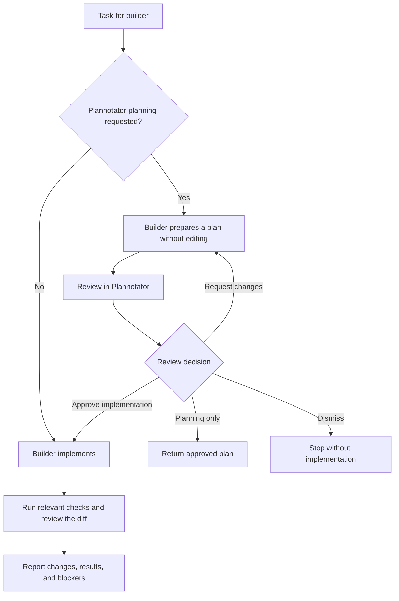
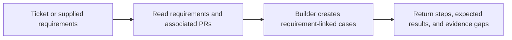
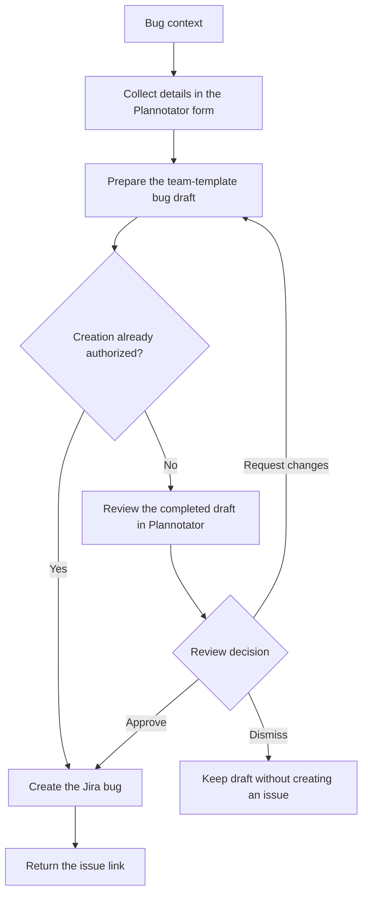
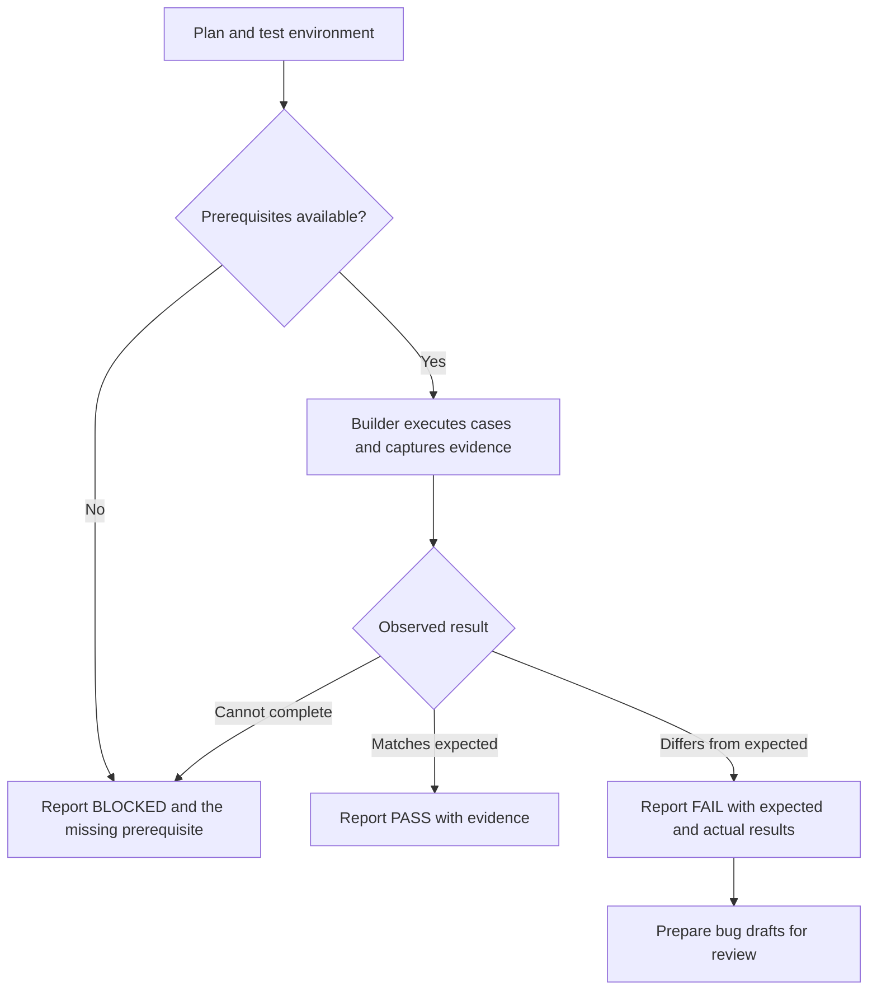
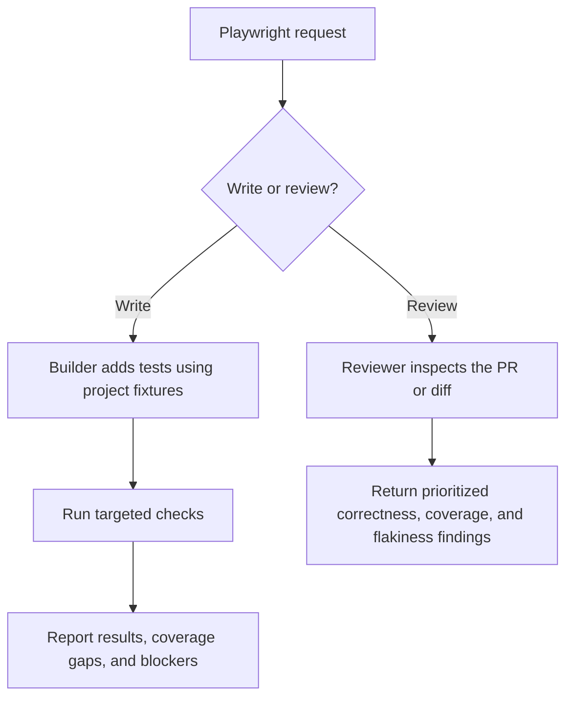

# OpenCode workflows

## Agents

| Agent | Mode | Purpose |
| --- | --- | --- |
| builder | Primary, default | Answer questions, implement changes, verify results, and finish tasks |
| chat | Primary, visible | Discuss and investigate without changing files |
| explore | Subagent | Investigate a bounded repository or documentation question |
| reviewer | Subagent | Review correctness and coverage and return actionable findings |

## Workflows

### Implementation and optional planning

Ask builder to implement directly, or use `/build-plan <outcome>` to plan through
Plannotator first. Select builder as the approval target when you want implementation.

### Manual test planning

Use `/manual-test-plan <ticket-or-context>` to prepare cases without running them.

### Jira bug creation

Use `/bug <context>` in the work profile.

### Manual test execution

Use `/manual-test <plan-or-ticket> <environment>` with an authorized test environment.

### Playwright writing and review

Use `/pw-test <ticket-or-scope>` to add and run tests, or `/pw-review <PR-or-diff>`
for a read-only review.

## Commands

| Command | Agent | Result |
| --- | --- | --- |
| `/build-plan <outcome>` | builder | Plannotator plan followed by approved implementation |
| `/manual-test-plan <ticket-or-context>` | builder | Requirement-linked manual cases |
| `/bug <context>` | builder | Work Jira bug draft and issue link after authorized creation |
| `/manual-test <plan-or-ticket> <environment>` | builder | PASS, FAIL, or BLOCKED for each case, with evidence |
| `/pw-test <ticket-or-scope>` | builder | Added tests and execution results |
| `/pw-review <PR-or-diff>` | reviewer | Prioritized findings and coverage gaps |
| `/plannotator-review` | builder | Interactive code review |
| `/plannotator-annotate <target>` | builder | Artifact annotations |
| `/plannotator-last` | builder | Annotations on the last response |

## Permissions

| Agent | Reads and lookup | File edits | Tests and evidence capture | Delegation | External writes | Unknown commands, installs, external directories |
| --- | --- | --- | --- | --- | --- | --- |
| builder | Allow | Allow | Allow configured checks; browser actions ask | explore, reviewer | Jira writes ask | Ask |
| chat | Allow | Deny | Deny | explore only | Deny | Deny |
| explore | Allow | Deny | Deny | Deny | Deny | Deny |
| reviewer | Allow | Deny | Deny | Deny | Deny | Deny |

| Boundary | All agents |
| --- | --- |
| Credential files | Deny; safe example files can be read |
| Pushes, destructive Git, history rewriting, blanket staging, hook bypasses | Deny |
| Jira deletion | Deny |
| Launching builder as a subagent | Deny |

## Plugins

| Plugin | Purpose |
| --- | --- |
| Plannotator | Review optional implementation plans, code, and artifacts |
| RTK | Reduce shell output and report token savings |
| PR context (personal) | Retrieve PR changes and evidence for selected test types |
