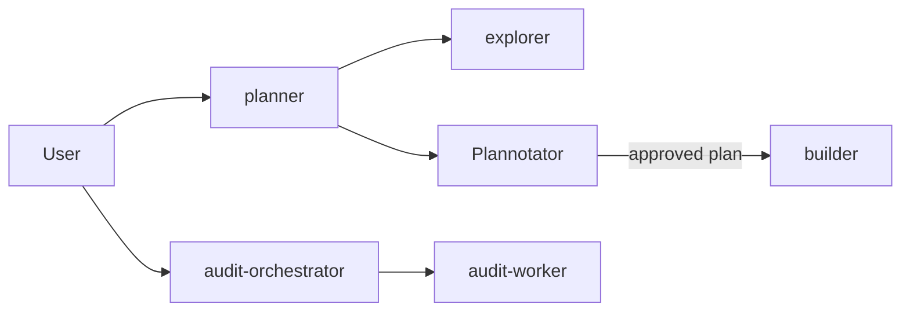
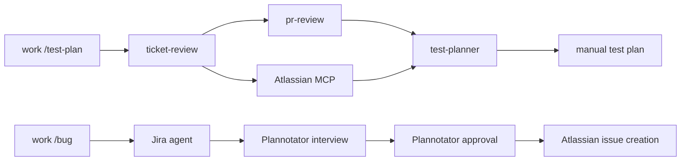

# OpenCode configuration

OpenCode 2.0.20 uses this directory as the global config through Home Manager.
`opencode.jsonc` keeps personal provider defaults. `cli.json` keeps the personal UI settings.
The company migration bundle is inactive under `work-migration/`.

## Layout

| Path | Purpose |
| --- | --- |
| `opencode.jsonc` | Global settings and agent registrations |
| `agents/` | System prompts for the six global agents |
| `cli.json` | Global terminal UI settings |
| `plugins/` | Reusable local plugins |
| `skills/` | Reusable skills |
| `work-migration/` | Company overlay and retained work assets to copy manually |

## Plugins

| Plugin | Purpose |
| --- | --- |
| `plugins/rtk` | Rewrites supported shell commands through RTK. OpenCode still checks permissions. |
| `plugins/pr-context` | Provides read-only `pr_context_get` for GitHub PR planning. |
| `@plannotator/opencode@0.27.22` | Sends plans to Plannotator and hands approved plans to `builder`. |

## Agents

| Agent | Location | Purpose |
| --- | --- | --- |
| `chat` | Global | Read-only conversation and exploration. |
| `planner` | Global | Researches and submits an implementation plan. |
| `explorer` | Global | Read-only repository and documentation research. |
| `builder` | Global | Implements an approved plan. |
| `audit-orchestrator` | Global | Coordinates approved dotfiles audits. |
| `audit-worker` | Global | Implements assigned audit checkpoints. |
| `ticket-review` | Work migration | Coordinates Jira, PR review, and manual test planning. |
| `pr-review` | Work migration | Reviews linked PRs for test scenarios. |
| `test-planner` | Work migration | Produces manual tests from Jira and PR evidence. |
| `Jira` | Work migration | Reads Jira tickets and creates reviewed bugs. |

The four core agents have personal models in the global config. The work overlay
changes their models and the permissions that differ. It also changes `chat` to
two steps. The global config hides OpenCode's built-in `general`, `build`, and
`plan` agents.

## Commands

| Command | Location | Purpose |
| --- | --- | --- |
| `/test-plan` | Work migration | Creates a manual test plan from a Jira ticket and linked PRs. |
| `/bug` | Work migration | Collects, reviews, and creates one Jira bug. |
| `test-plan.md` | Retained, inactive | Earlier PR test-plan command prompt. |

The previous `prompts/` directory is split between `agents/` and `commands/`.
Inactive prompts live in `work-migration/retained/` so they are not lost or
accidentally enabled. This includes all six former `prompts/back/` agents and
`orchestrator.md`. The active `Jira` agent uses the former `jira-operator.md`.

## Workflows





## Manual company migration

1. Copy `work-migration/opencode.jsonc` and its `opencode.schema.json` to the
   company repository root.
2. Copy `work-migration/.opencode/` to the company repository's `.opencode/`.
   Copy `work-migration/scripts/` where company scripts belong.
3. Copy `work-migration/retained/` as an archive. Review its older prompts
   before enabling them. It also holds the previous work `cli.json` for
   reference. Add company `AGENTS.md` instructions in that repository.
4. Verify effective provider policies, models, agent permissions, and `{file:...}`
   paths in a company checkout. Restart OpenCode after applying the Home Manager
   link change. The migration overlay relies on project config merging with the
   global config; schema validation alone does not prove runtime merge behavior.
5. After copying and verifying the bundle, remove `work-migration/` from personal
   dotfiles in a separate change.

The work overlay permits GitHub Copilot and configures Atlassian MCP. It keeps the
work-only agents and their exact permissions. It does not copy the four core
agent prompts or the generic RTK and Plannotator plugins.

## Checks

Run from this directory:

```sh
pnpm test:schema
pnpm test
pnpm typecheck
```

`schema:generate` updates both schema copies from pinned `@opencode/schema@2.0.20`.
The executable is Homebrew-managed. OpenCode self-updating is disabled.
`service.json` is machine-local runtime state and remains ignored.
