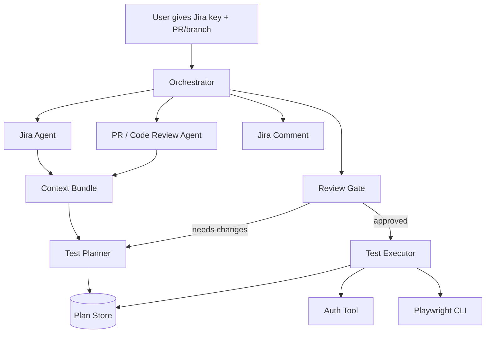

# Manual Testing Agent Workflow Notes

## Core Concern

The workflow is probably a little overbuilt, but the core idea is sound.

The useful pieces are:

- Orchestrator agent
- Jira operator agent
- PR/code-change reviewer agent
- Test planner agent
- Test executor agent
- Plan store
- Repo map/index/query skills
- Auth skill for safely creating Playwright auth state

The main simplification is to treat this as a pipeline with structured handoffs, not a swarm of agents all talking to each other and improvising.

---

## Mental Model

One orchestrator manages the workflow.

Specialist agents produce structured artifacts.

The plan store owns only the canonical test plan lifecycle.



The orchestrator should not do the work. It should route work, verify handoffs, enforce workflow state, and stop invalid transitions.

---

## Recommended Agent Split

| Agent                    | Job                                                                                      | Should use                               | Should not do                      |
| ------------------------ | ---------------------------------------------------------------------------------------- | ---------------------------------------- | ---------------------------------- |
| `jira-operator`          | Fetch ticket details, acceptance criteria, linked information, and comment final results | Jira MCP/tool                            | Interpret code deeply              |
| `change-impact-analyzer` | Summarize changed files, behavior changes, risk areas, likely regressions                | `git diff`, repo map/index/query         | Write the final test plan          |
| `test-planner`           | Turn Jira context and PR/code-change context into a manual test plan                     | Plan store, Jira/change context          | Execute tests                      |
| `test-executor`          | Run approved test plan using Playwright/manual commands and collect evidence             | Auth tool, Playwright CLI, approved plan | Rewrite the plan mid-run           |
| `orchestrator`           | Own workflow state and handoffs                                                          | All agents, plan store transitions       | Become a giant do-everything agent |

---

## Naming Recommendation

Rename `git PR reviewer` to `change-impact-analyzer`.

The job is not really to review the PR. The job is:

> Given the diff, identify what behavior changed and what deserves testing.

That agent should produce testing-relevant facts, not general code-review commentary.

Keep:

- `jira-operator`
- `test-planner`
- `test-executor`
- `orchestrator`

---

## Simplified Workflow

Command shape:

```text
/manual-test SKY-123 --pr current
```

Workflow:

1. Orchestrator creates a run context.
2. Jira operator fetches ticket context.
3. Change-impact analyzer reviews the diff and affected code.
4. Test planner creates a canonical test plan.
5. Orchestrator or reviewer gate validates the plan.
6. Approved plan is stored in the plan store.
7. Test executor fetches the approved plan.
8. Test executor calls auth tool if needed.
9. Test executor runs Playwright/manual validation.
10. Test executor records results.
11. Jira operator posts final comment.

---

## Suggested Run Directory

Use temporary structured artifacts for everything except the canonical approved plan.

```text
.opencode/runs/SKY-123/
  jira-context.json
  change-impact.json
  approved-plan.md
  execution-report.json
  artifacts/
    playwright-output.txt
    screenshots/
    traces/
```

The point is to avoid agent-to-agent chat soup. Each agent should create a useful artifact that the next step can consume.

---

## Structured Handoffs

### Jira Context

```json
{
  "ticket_key": "SKY-123",
  "summary": "...",
  "description": "...",
  "acceptance_criteria": [],
  "known_constraints": [],
  "links": []
}
```

### Change Impact Context

```json
{
  "changed_files": [],
  "behavior_changes": [],
  "risk_areas": [],
  "suggested_test_focus": [],
  "existing_tests_to_run": [],
  "unknowns": []
}
```

### Canonical Test Plan

```json
{
  "goal": "Validate SKY-123 against Jira acceptance criteria and PR behavior changes.",
  "assumptions": [],
  "steps": [
    {
      "id": "login",
      "title": "Authenticate as test user",
      "type": "setup",
      "status": "todo"
    },
    {
      "id": "happy-path",
      "title": "Validate primary user flow",
      "type": "manual",
      "status": "todo"
    },
    {
      "id": "regression",
      "title": "Check changed code regression areas",
      "type": "manual",
      "status": "todo"
    }
  ],
  "acceptance_criteria": [],
  "validation": [
    "Run relevant Playwright specs",
    "Capture failures with command output and reproduction notes"
  ],
  "touched_files": [],
  "risks": [],
  "execution_notes": []
}
```

### Execution Report

```json
{
  "ticket_key": "SKY-123",
  "plan_id": "...",
  "result": "pass | fail | blocked",
  "environment": "...",
  "commands_run": [],
  "passed_steps": [],
  "failed_steps": [],
  "blocked_steps": [],
  "artifacts": [],
  "notes": []
}
```

---

## Plan Store Role

The plan store should be boring state management.

Use it for:

- Plan state
- Plan versions
- Review comments
- Approved execution handoff
- Final execution notes

Do not use it for:

- Raw Jira dumps
- Raw git diffs
- Giant Playwright logs
- Every random thought an agent has while working

The rule should be:

> The database is canonical. Markdown is only a rendered view.

---

## Plan Store State Machine

Current useful states:

```text
drafting
  ↓
reviewing
  ↓
approved
  ↓
executing
  ↓
done
```

Escape hatches:

```text
reviewing → drafting
executing → blocked
executing → abandoned
```

Recommended addition:

```text
blocked
```

Manual testing often gets blocked by environment issues, missing test data, auth problems, or broken dependencies. `abandoned` is too final for that.

---

## Review Gate Checklist

Before approving a plan, verify:

- Every Jira acceptance criterion has at least one test step.
- Every major behavior change has at least one test step.
- Auth/setup/data requirements are explicit.
- Playwright commands are listed when applicable.
- Risks and unknowns are captured.
- Expected results are clear enough for another agent or human to execute.

If any item fails, transition the plan back to `drafting` and assign it to `test-planner`.

---

## Tool Permission Boundaries

Do not let every agent call every tool.

| Agent                               | Allowed tools                                                   |
| ----------------------------------- | --------------------------------------------------------------- |
| `orchestrator`                      | Delegate agents, plan get/list/transition/approve               |
| `jira-operator`                     | Jira fetch/comment only                                         |
| `change-impact-analyzer`            | `git diff`, repo-map, repo-index, repo-query                    |
| `test-planner`                      | Plan create/claim/revise, read Jira/change context              |
| `test-executor`                     | Plan get approved, auth, Playwright CLI, append execution notes |
| `jira-commenter` or `jira-operator` | Execution report to Jira comment                                |

The orchestrator should be the only agent deciding when the workflow moves stages.

Specialists should produce artifacts, not mutate the whole workflow freely.

---

## Repo Tool Usage

Do not force every ticket through repo mapping or indexing.

Use `repo-map` when:

- Exploring a repo for the first time
- Creating an architecture overview
- Needing a visual or structural map

Use `repo-index` when:

- The repo has not been indexed yet
- The repo changed meaningfully
- `repo-query` needs fresh data

Use `repo-query` when:

- Looking for modules, dependencies, entrypoints, or structural relationships
- The PR/code-change reviewer needs broader context than `git diff` provides

Default PR review should start with:

```text
git diff
changed files
nearby tests
known affected areas
```

Only escalate to repo map/index/query when useful.

---

## Auth Tool Role

The auth skill should remain centralized and primarily owned by the test executor.

Purpose:

- Create or reuse Playwright auth state
- Avoid exposing secrets to every agent
- Prevent multiple agents from racing to generate auth state
- Keep secret access behind a single tool boundary

The executor should call auth before running tests that require login.

Other agents should not need direct secret access.

---

## Minimum Viable Workflow

Start with this version:

```text
/manual-test <JIRA_KEY> [--pr current]

orchestrator:
  1. ask jira-operator for ticket context
  2. ask change-impact-analyzer for diff summary
  3. ask test-planner for plan
  4. store plan
  5. approve plan if checklist passes
  6. ask test-executor to execute approved plan
  7. ask jira-operator to comment result
```

This should work before adding more complexity.

---

## Main Recommendation

Use fewer autonomous decisions and more structured artifacts.

The design should feel like this:

```text
Jira context + change impact → test plan → approved plan → execution report → Jira comment
```

Not like this:

```text
agent talks to agent talks to agent talks to tool talks to another agent until nobody knows what happened
```

The orchestrator owns the workflow.

The specialist agents own their artifacts.

The plan store owns the canonical test plan lifecycle.

The executor owns auth and Playwright execution.

That separation is the difference between an actual workflow and a tiny distributed bureaucracy wearing a hoodie.
